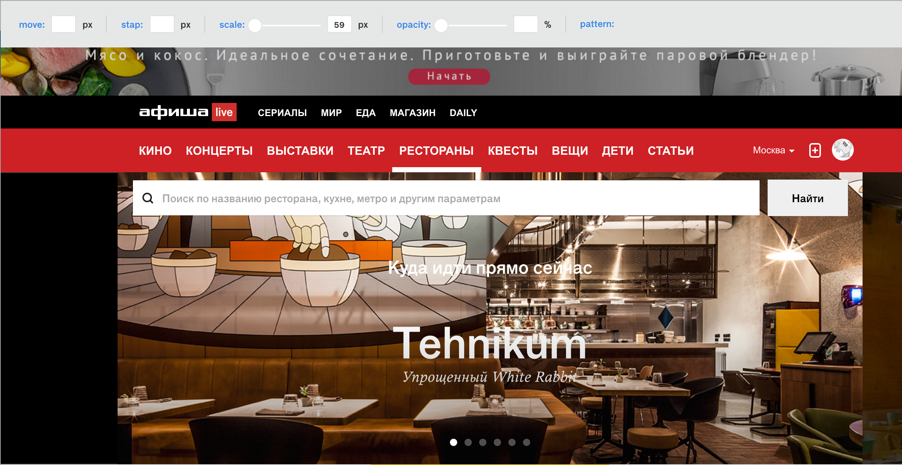

#Honeycomb

#!update!
npm run server - запустит сайт на порту 3000. В качестве сервера ExpressJS

######CSS NAMESPACE
Honeycomb
Honeycomb-control

##Release v.1
####Control panel:
- Input Scale
- Input Opacity
- Button Modes
- Button Save Pattern
- Button Load Pattern
- States: Hide, Show, Active (default: hide)

####Combs:
- SVG(PNG?)
- Choose Element

####Save/Load:
- Create Ajax request with [backbone](http://backbonejs.ru/#Model-sync) for save json local

#####Model(default):
- Name
- Scale
- Opacity
- Mode

#####Model(optional):
- Array of element (hide for user)
- Window width
